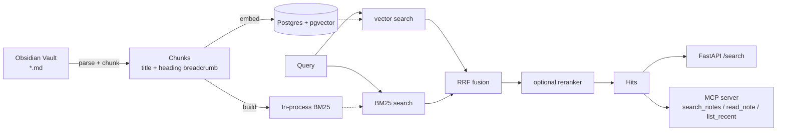

# note-rag

[](https://github.com/lijiachao339-design/note-rag/actions/workflows/ci.yml)

**面向个人 Obsidian 知识库的混合检索服务**：向量检索 + BM25 + RRF 融合 + 可插拔 rerank，通过 HTTP API 和 **MCP Server** 两种方式对外提供服务。

> 下面所有数字都是本仓库跑出来的实测值，不是估计。
> **检索指标目前是"离线 hashing 嵌入"的基线**——它暴露出三个已知缺口（向量侧无语义能力、
> BM25 没有倒排索引、reranker 尚未实现），完整的假设与结论见
> [docs/experiments/exp-001-baseline-hashing-embedder.md](docs/experiments/exp-001-baseline-hashing-embedder.md)。

## 实测结果（本机已跑通，不是占位值）

| 项 | 实测值 |
| --- | --- |
| 语料 | **1947 篇 / 13.41 MB** markdown，由 `scripts/prepare_corpus.py` 固化，指纹 `9854a816415b1a9579b6786af6f975f19af4e06f` |
| 切块 | **17524 chunks / 1947 notes** |
| 首次全量索引 | **48.46 s**，17520 次嵌入调用 |
| 重复同步（增量不变量） | **1.04 s，0 次嵌入**（`nothing changed; skipping embeddings entirely`） |
| 静态门禁 | `ruff check` ✅ ｜ `ruff format --check` ✅ ｜ `mypy --strict` 13 个文件 0 问题 |
| 测试 | **92 passed**（fusion / metrics / bm25 / notes / ingest / retriever / cli-eval） |
| HTTP API | `/healthz` → `{"status":"ok","corpus":{"chunks":17524,"notes":1947}}`；`/search` 返回带 `note_path`/`title`/正文的命中 |
| 评测集 | **296 行** = 269 条可回答（135 EN + 134 ZH，来自 90 篇笔记，中英各 45 篇）+ 27 条不可回答（9 EN + 18 ZH）；`answer_span` 逐字校验丢弃 1 条，负样本覆盖率闸门丢弃 3 条；66/269 标记为词法泄漏 |
| 检索指标（基线） | 269 条可回答问题上（strict 视图），`keyword` recall@5 **0.8922** / nDCG@10 **0.7967** ＞ `hybrid` 0.7138 / 0.6237 ＞ `vector` 0.4238 / 0.3829；剔除词法泄漏后 `keyword` recall@5 **0.8621**；p50 延迟：`vector` **48 ms** / 其余三者 ~350–397 ms（详见下节与实验记录） |

> ⚠️ **依赖 `mcp>=2.2`**：`mcp` 2.x 把 `FastMCP` 改名为 `MCPServer`
> （`from mcp.server.mcpserver import MCPServer`）。照抄 v1 示例会得到
> `ModuleNotFoundError: No module named 'mcp.server.fastmcp'`。

### 覆盖率现状（诚实记录，别在简历里含糊）

`pytest --cov` 总覆盖率约 **48%**：`bm25` 97%、`notes` 97%、`fusion` 100%、`metrics` 94%、`ingest` 87%，
但 `api` / `cli` / `mcp_server` / `retriever` 里依赖数据库的路径还缺集成测试。
补法是起一个真实 Postgres 的 integration 测试（CI 里已有 pg service，把它用起来）。

## 为什么用 Postgres 而不是专用向量库

1. 语料规模在 1 万 chunk 量级，pgvector 的 HNSW 索引足够快；
2. 事务、过滤条件、备份方案全部复用 Postgres，不需要额外运维一个组件；
3. 关键词检索跑在进程内的 BM25（见 `src/note_rag/bm25.py`）——Postgres 的 `simple` 词典不切分中文，而自实现的 BM25 既可测试又可解释。

## 架构



## Shell 选择：PowerShell 还是 Git Bash？

**两者都能完整跑通本项目，没有"必须 PowerShell"这回事。** 三条实测结论：

| 事项 | PowerShell | Git Bash | 说明 |
| --- | --- | --- | --- |
| `uv` / `pytest` / `ruff` / `docker compose` | ✅ | ✅ | 跨 shell 完全一致，行为无差异 |
| 环境变量 | `$env:NOTE_RAG_TOP_K='20'` | `export NOTE_RAG_TOP_K=20` | 写法不同，仅此而已 |
| 复制文件 | `Copy-Item a b` | `cp a b` | |
| Claude Code / DSH CLI | ✅ 直接可用 | ⚠️ **本机默认会失败**（见下节） | npm 生成三个 shim：`claude`(POSIX sh)、`claude.cmd`、`claude.ps1` |
| 启动 `claude` 时的 TUI 渲染 | ✅ 更稳 | ⚠️ 取决于终端 | Git Bash 默认终端 mintty 不是真正的 Windows 控制台，方向键 / 多行编辑 / Ctrl+C 有历史坑；用 Windows Terminal 承载 Git Bash 可缓解 |
| 一行流文本处理（grep/sed/awk/jq） | ⚠️ 别扭 | ✅ 顺手 | |
| 传给原生程序的绝对路径参数 | ✅ | ⚠️ MSYS 会改写 | 实测：`/var/lib/postgresql/data` 被改写成 `C:/Program Files/Git/var/lib/postgresql/data`；需 `MSYS_NO_PATHCONV=1` 或写 `//var/lib/...` |

### Git Bash 上的已知坑

Git Bash 完全能跑这个项目，但在 Windows 上有几个组合性问题值得先知道：

- **Anaconda 遮蔽 `cygpath`** → npm 生成的 `claude` shim 会解析出错误路径，`claude` 直接启动失败；
- **MSYS 会改写传给原生程序的绝对路径** → `docker run -v /abs/path` 挂载到错误的目录；
- **PowerShell 5.1 的编码默认按 ANSI 解码 UTF-8** → 中文输出乱码、`Get-Content` 行粘连。

每条的原因、验证命令与修复方式见 **[docs/troubleshooting.md](docs/troubleshooting.md)**。

一句话结论：**日常用 PowerShell（由 Windows Terminal 承载）当主 shell，Git Bash 留给 git 操作和文本处理一行流。**

### 一个常见误解（重要）

**在哪个 shell 里敲 `claude`，和 Claude Code 内部 Bash 工具用哪个 shell，是两件独立的事。**
真正决定它执行力的是后者——Windows 上它需要一个 bash（Git for Windows 或 WSL）。
所以"从 Git Bash 启动能让 Claude Code 更强"并不成立：从 PowerShell 启动，它照样用 bash 执行命令。

### 本仓库的做法：让 shell 选择不再重要

已提供两套**功能等价**的快捷脚本，任选其一，不用记命令：

```powershell
# PowerShell
.\scripts\dev.ps1 setup      # 起 pg/redis + 装依赖 + 生成 .env
.\scripts\dev.ps1 dry        # 干跑切块（不连库，先看质量）
.\scripts\dev.ps1 ingest     # 增量索引
.\scripts\dev.ps1 search "混合检索怎么融合两路召回"
.\scripts\dev.ps1 test       # 测试 + 覆盖率
.\scripts\dev.ps1 lint       # ruff + mypy
.\scripts\dev.ps1 serve      # HTTP API
.\scripts\dev.ps1 mcp        # MCP server
.\scripts\dev.ps1 eval       # 四模式消融
```

```bash
# Git Bash / WSL
scripts/dev.sh setup
scripts/dev.sh dry
scripts/dev.sh ingest
scripts/dev.sh search "混合检索怎么融合两路召回"
scripts/dev.sh test
scripts/dev.sh lint
scripts/dev.sh serve
scripts/dev.sh mcp
scripts/dev.sh eval
```

`.gitattributes` 已配置为**默认 LF**，因此 `.sh` 不会因为 Windows 的 `core.autocrlf=true`
被检出成 CRLF（那会让 bash 报 `bad interpreter: /bin/sh^M`，或让 Dockerfile 的 `\` 续行失效）。
若你已经 clone 过，执行一次 `git add --renormalize .` 让规则生效。

### 手动命令（两套等价，按需取用）

```powershell
winget install --id=astral-sh.uv -e          # 依赖：uv（Python 3.12，避开 3.14 的轮子问题）
docker compose up -d pg redis                # 起数据库与缓存
uv sync --all-groups                         # 装依赖
Copy-Item .env.example .env                  # 然后编辑 NOTE_RAG_VAULT_PATH
uv run note-rag ingest --dry-run --preview 5 # 干跑：只切块，不碰数据库
uv run note-rag ingest                       # 全量索引
uv run note-rag ingest                       # 再跑一次：应当输出 embeddings_computed = 0
```

```bash
winget install --id=astral-sh.uv -e
docker compose up -d pg redis
uv sync --all-groups
cp .env.example .env
uv run note-rag ingest --dry-run --preview 5
uv run note-rag ingest
uv run note-rag ingest
```

### 接入 Claude Code / DSH

两种 shell 里命令完全相同（PowerShell 与 Git Bash 均可）：

```bash
claude mcp add note-rag -- uv run --directory /path/to/note-rag note-rag mcp
```

```powershell
claude mcp add note-rag -- uv run --directory C:\path\to\note-rag note-rag mcp
```

加完在 Claude Code 里执行 `/mcp`，确认 `search_notes` / `read_note` / `list_recent` 三个工具可见。

## 评测（项目的核心资产）

评测在 **note 粒度**上打分：人工标注"这条笔记能否回答这个问题"，而不是标注 chunk——后者不可扩展。

`eval/dataset.jsonl` 每行一条：

```json
{"id": "q0007", "question": "RRF 为什么比加权求和更稳？",
 "relevant_notes": {"混合检索__a1b2c3d4.md": 2, "混合检索.zh__e5f6a7b8.md": 1},
 "answerable": true, "lang": "zh", "leak": false, "leak_min_df": 17}
```

- `relevant_notes` 是**分级相关**：问题所出自的那一篇记 `2`，它的译文孪生记 `1`。
  孪生同样能回答该问题，判它不相关是错的；但它也不是问题的出处。
- `answerable: false` + `relevant_notes: []` 是**不可回答问题**，故意混入，用来量化"检索器会不会硬凑答案"。
- `leak: true` 标记**词法泄漏**：问题里抄了目标笔记的近乎唯一的标识符，BM25 不检索也能精确匹配。
  这类条目**不删除**，但引用总均值时必须知道它们在里面（`eval/dataset.report.md` 有分组表）。

生成流程：`note-rag gen-eval` 导出笔记样本 → 交给廉价模型批量生成候选问题 →
`scripts/build_eval_dataset.py` 做确定性编译（`answer_span` 逐字校验、元问题过滤、泄漏标记、
负样本覆盖率复核）→ 强模型抽检 → 人工确认。同一批候选跑两次必须得到逐字节相同的输出。

跑消融实验：

```powershell
uv run note-rag eval --dataset eval/dataset.jsonl --out eval/out/ablation.md
```

输出（**实测值**，评测集 296 行 = **269 可答 + 27 不可答，两者分开统计**）：

**排序质量 · strict 视图（只认问题所出自的那一篇笔记；269 条可回答问题）**

| metric | vector | keyword | hybrid | hybrid_rerank |
| --- | --- | --- | --- | --- |
| recall@5 | 0.4238 | **0.8922** | 0.7138 | 0.7138 |
| recall@10 | 0.5353 | **0.9294** | 0.8662 | 0.8662 |
| mrr | 0.3362 | **0.7534** | 0.5490 | 0.5490 |
| ndcg@10 | 0.3829 | **0.7967** | 0.6237 | 0.6237 |

**排除词法泄漏后（strict，剔除 66 条抄了目标笔记指纹词的问题）**

| metric | vector | keyword | hybrid | hybrid_rerank |
| --- | --- | --- | --- | --- |
| recall@5 | 0.3941 | **0.8621** | 0.6749 | 0.6749 |
| ndcg@10 | 0.3358 | **0.7487** | 0.5824 | 0.5824 |

**graded 视图（译文孪生也算相关）—— 只用来看多语言缺口**

| metric | vector | keyword | hybrid | hybrid_rerank |
| --- | --- | --- | --- | --- |
| recall@5 | 0.2175 | 0.4535 | 0.3606 | 0.3606 |
| ndcg@10 | 0.3175 | **0.6609** | 0.5169 | 0.5169 |

**拒答（27 条不可回答问题；top-1 命中的内容词覆盖率 < 0.30 判为拒答）**

| metric | vector | keyword | hybrid | hybrid_rerank |
| --- | --- | --- | --- | --- |
| 拒答率（不可回答，越高越好） | 0.9630 | 0.7407 | 0.9259 | 0.9259 |
| 误拒率（可回答，越低越好） | 0.6617 | **0.2825** | 0.3941 | 0.3941 |
| 同阈值下 recall@5 | 0.2119 | **0.6617** | 0.4461 | 0.4461 |

**延迟（每模式重复 3 轮，取重复间中位数）**

| metric | vector | keyword | hybrid | hybrid_rerank |
| --- | --- | --- | --- | --- |
| p50_ms | **47.9** | 349.7 | 396.5 | 397.2 |
| p50 重复间极差 | 0.1 | 11.6 | 4.1 | 30.7 |

### 怎么读这张表（别误读成"hybrid 检索没用"）

0. **先看视图，再看数字。** 语料是严格的双语镜像，266/269 条问题有**两篇**相关笔记
   （原文 grade 2 + 译文孪生 grade 1），所以"什么算相关"必须说清楚：
   - **`strict`（只认原文）= 要引用的那个。** 它问的是"检索有没有找到写出这道题的那篇笔记"，
     与 `docs/experiments/exp-001` 的单标签口径一致，也不受语言边界影响。
   - **`graded`（含孪生）的 recall 有约 0.5 的结构性上限**：纯词法检索永远跨不过语言边界，
     实测孪生进 top-5 只有 2/266 次。所以 `graded recall@5 = 0.4535` 反映的是**语料是双语镜像**，
     不是 BM25 差——它的 strict recall@5 是 **0.8922**，两者差了整整一倍。
     早先版本的 README 拿 0.4472 当头牌数字，会让人以为 BM25 很弱，那是误导。
   - **`graded` 的 nDCG@10 才是多语言缺口的诚实度量**（同时看原文和孪生的名次）。
     换上真实的多语言嵌入模型之后，这一列才会开始动。
   - `precision@k` 已移除：它恒等于 `recall@k × |relevant| / k`，不提供独立信息。
   - 不可回答问题**不进**排序质量表：它们在 recall/MRR/nDCG 上恒为 0，与检索器返回什么无关。
1. **`vector` 这一列衡量的不是语义能力**：当前用的是离线 hashing 嵌入（token 哈希到 384 维桶），
   本质是**有损的词法检索**。换成真实嵌入模型后这一列才会变成语义能力。
2. **RRF 无法拯救一路无效的召回器**：`hybrid` 正好落在 `vector` 与 `keyword` 之间，符合"融合一个强召回器
   与一个弱召回器"的预期。RRF 保证的是鲁棒性，不是免费增益；要增益必须两路都有效且互补。
3. **`hybrid_rerank` 与 `hybrid` 完全相同是刻意的**：`Reranker` 目前是 no-op 原样返回，
   表格如实反映"尚未实现"。延迟上两者差 0.7 ms 而重复间极差有 30.7 ms——**不可区分**。
4. **`keyword` 的数字里有一部分是评测集自己送的。** 66/269 条问题把目标笔记里近乎唯一的
   标识符逐字抄进了问题（`leak: true`）。剔除它们之后 `keyword` recall@5 从 0.8922 掉到
   **0.8621**；按词法重合度分组，最极端的一组（共享 token 的语料文档频率 ≤ 2）是 **0.985**，
   而没有指纹词可抄的一组（df > 50）只有 **0.708**。引用 `keyword` 的数字时请一并说明这一点。
5. **拒答的三个数必须一起看。** `vector` 的拒答率 0.9630 看起来最高，但它误拒了 66% 的
   可回答问题——它不是"懂得拒答"，它是几乎什么都召不回。合成判别力（拒答率 − 误拒率）：
   `hybrid` 0.532 ＞ `keyword` 0.458 ＞ `vector` 0.301。
   **已知缺陷**：这个阈值对中英不公平（英文误拒 5.2%，中文误拒 51.5%），原因见
   [docs/experiments/exp-003](docs/experiments/exp-003-dataset-v2-leakage-and-language.md)。
6. **延迟只有 `vector` 与其余三者可区分。** 瓶颈是 `bm25.py` 每次查询全量扫描 17524 个文档；
   建倒排索引后要证明有效，新的 p50 必须低于 **320 ms** 才算可测量的改进。

完整的假设 / 方法 / 结果 / 结论 / 下一步见
[docs/experiments/](docs/experiments/)，口径修复的过程见
[docs/reviews/](docs/reviews/)（review-001 审查 → impl-003 数据层 → impl-004 报告层 → impl-005 双视图）。

## 开发

```powershell
uv run ruff check . && uv run ruff format --check .
uv run mypy
uv run pytest --cov=src/note_rag --cov-report=term-missing
```

无数据库时的离线自检（覆盖切块与增量索引两个关键不变量）：

```powershell
python .selfcheck.py
```

## 已知限制 / 下一步

- [ ] rerank 目前是 no-op，需要接一个 cross-encoder（CPU 上跑 `bge-reranker-base`）
- [ ] 关键词索引在启动时全量构建，语料继续增长后要改成增量刷新
- [ ] 中文分词用 unigram + bigram 近似，可用 `pg_bigm`/`zhparser` 做对比实验
- [ ] embedding 缓存是进程内 dict，多副本部署时需要换成 Redis
- [ ] 小节的合并策略（跨同级标题是否该共享父级 breadcrumb）还没做消融

## 目录结构

```
src/note_rag/
├── notes.py        # Obsidian 解析 + heading 感知切块（稳定 id / content hash）
├── bm25.py         # 零依赖 BM25（含中文 bigram 近似分词）
├── fusion.py       # RRF 融合（确定性 tie-break）
├── metrics.py      # recall@k / MRR / nDCG@k / 百分位
├── embed.py        # 离线 hashing 嵌入 + OpenAI 兼容远程嵌入 + 缓存
├── store.py        # Postgres + pgvector：schema / upsert / 向量检索
├── retriever.py    # 四种检索模式的统一实现（消融共用同一代码路径）
├── ingest.py       # 增量同步：diff -> 按需嵌入 -> upsert / delete
├── api.py          # FastAPI
├── mcp_server.py   # MCP stdio server
└── cli.py          # 命令行入口
```
