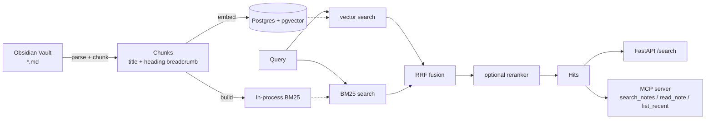

# note-rag

**面向个人 Obsidian 知识库的混合检索服务**：向量检索 + BM25 + RRF 融合 + 可插拔 rerank，通过 HTTP API 和 **MCP Server** 两种方式对外提供服务。

> 这是 `实习项目路线图.md` 中 P1 项目的工程骨架，已包含可运行的核心链路、测试、CI 与 Docker。当前检索指标为占位值，替换成你自己跑出来的数字后才写进简历。

## 实测结果（本机已跑通，不是占位值）

| 项 | 实测值 |
| --- | --- |
| 语料 | **1947 篇 / 13.41 MB** markdown，由 `scripts/prepare_corpus.py` 固化，指纹 `9854a816415b1a9579b6786af6f975f19af4e06f` |
| 切块 | **17520 chunks / 1945 notes** |
| 首次全量索引 | **48.46 s**，17520 次嵌入调用 |
| 重复同步（增量不变量） | **1.04 s，0 次嵌入**（`nothing changed; skipping embeddings entirely`） |
| 静态门禁 | `ruff check` ✅ ｜ `ruff format --check` ✅ ｜ `mypy --strict` 13 个文件 0 问题 |
| 测试 | **72 passed**（fusion / metrics / bm25 / notes / ingest / retriever） |
| HTTP API | `/healthz` → `{"status":"ok","corpus":{"chunks":17520,"notes":1945}}`；`/search` 返回带 `note_path`/`title`/正文的命中 |
| 检索指标 | 待填：需要先做 `eval/dataset.jsonl`（见下节） |

> ⚠️ **依赖 `mcp>=2.2`**：`mcp` 2.x 把 `FastMCP` 改名为 `MCPServer`
> （`from mcp.server.mcpserver import MCPServer`）。照抄 v1 示例会得到
> `ModuleNotFoundError: No module named 'mcp.server.fastmcp'`。

### 覆盖率现状（诚实记录，别在简历里含糊）

`pytest --cov` 总覆盖率约 **48%**：`bm25` 97%、`notes` 97%、`fusion` 100%、`metrics` 94%、`ingest` 87%，
但 `api` / `cli` / `mcp_server` / `retriever` 里依赖数据库的路径还缺集成测试。
补法是起一个真实 Postgres 的 integration 测试（CI 里已有 pg service，把它用起来）。

## 为什么用 Postgres 而不是专用向量库

1. 语料规模在 1 万 chunk 量级，pgvector 的 HNSW 索引足够快；
2. 事务、过滤条件、备份方案全部复用 Postgres，不需要额外运维一个组件；
3. 关键词检索跑在进程内的 BM25（见 `src/note_rag/bm25.py`）——Postgres 的 `simple` 词典不切分中文，而自实现的 BM25 既可测试又可解释。

## 架构



## Shell 选择：PowerShell 还是 Git Bash？

**两者都能完整跑通本项目，没有"必须 PowerShell"这回事。** 三条实测结论：

| 事项 | PowerShell | Git Bash | 说明 |
| --- | --- | --- | --- |
| `uv` / `pytest` / `ruff` / `docker compose` | ✅ | ✅ | 跨 shell 完全一致，行为无差异 |
| 环境变量 | `$env:NOTE_RAG_TOP_K='20'` | `export NOTE_RAG_TOP_K=20` | 写法不同，仅此而已 |
| 复制文件 | `Copy-Item a b` | `cp a b` | |
| Claude Code / DSH CLI | ✅ 直接可用 | ⚠️ **本机默认会失败**（见下节） | npm 生成三个 shim：`claude`(POSIX sh)、`claude.cmd`、`claude.ps1` |
| 启动 `claude` 时的 TUI 渲染 | ✅ 更稳 | ⚠️ 取决于终端 | Git Bash 默认终端 mintty 不是真正的 Windows 控制台，方向键 / 多行编辑 / Ctrl+C 有历史坑；用 Windows Terminal 承载 Git Bash 可缓解 |
| 一行流文本处理（grep/sed/awk/jq） | ⚠️ 别扭 | ✅ 顺手 | |
| 传给原生程序的绝对路径参数 | ✅ | ⚠️ MSYS 会改写 | 实测：`/var/lib/postgresql/data` 被改写成 `C:/Program Files/Git/var/lib/postgresql/data`；需 `MSYS_NO_PATHCONV=1` 或写 `//var/lib/...` |

### ⚠️ 本机已确认的 Git Bash 故障：Anaconda 遮蔽了 `cygpath`

实测环境：Git Bash 5.2.37(MSYS)、Claude Code 2.1.270。

| 启动方式 | `command -v cygpath` | `claude --version` |
| --- | --- | --- |
| 登录 shell（**双击打开 Git Bash 的默认方式**） | `/d/Anaconda3/Library/usr/bin/cygpath` | ❌ `No such file or directory` |
| 非登录 shell（`bash script.sh`） | `/usr/bin/cygpath` | ✅ `2.1.270 (Claude Code)` |

原因链（每一步都实测确认）：

1. `~/.bash_profile` 里有 conda init（5 行 conda 相关代码）；
2. 登录 shell 加载它后，Anaconda 把 `/d/Anaconda3/Library/usr/bin` 插到 PATH **第 3 位**，Git 的 `/usr/bin` 被挤到第 11 位；
3. Anaconda 自带一个 `cygpath`，于是 npm 的 `claude` shim 里的 `cygpath -w` 调用命中了它；
4. Anaconda 的 cygpath 把 `/c/Users/...` 按自己的根目录换算，得到
   `D:\Anaconda3\Library\c\Users\...\npm/node_modules/.../claude.exe` —— 这个路径不存在。

**修复（三选一，推荐第 1 个）**：

```bash
# 1) 在 ~/.bash_profile 的 conda 块【之后】追加一行，把 Git 的 /usr/bin 抢回最前（永久生效）
echo 'export PATH="/usr/bin:$PATH"' >> ~/.bash_profile

# 2) 临时修正，只影响这一次调用
PATH="/usr/bin:$PATH" claude

# 3) 不再在 Git Bash 里用 conda（你已经在用 uv，conda 在这里价值不大）
#    用编辑器把 ~/.bash_profile 里 conda init 那几行注释掉
```

**另一个副作用**：登录 shell 里裸 `python` 会解析到 **Anaconda 的 Python**，而不是 `D:\python`(3.14)。
所以本项目一律走 `uv run ...`，不要用裸 `python`，否则解释器会随 shell 漂移。

用同一套 shim 机制的 `pnpm` 大概率也受影响，顺手验证一下：`bash -lc 'pnpm --version'`。
`uv` 是原生 exe（装在 `%USERPROFILE%\.local\bin`），不受此问题影响。

### 一个常见误解（重要）

**在哪个 shell 里敲 `claude`，和 Claude Code 内部 Bash 工具用哪个 shell，是两件独立的事。**
真正决定它执行力的是后者——Windows 上它需要一个 bash（Git for Windows 或 WSL）。
所以"从 Git Bash 启动能让 Claude Code 更强"并不成立：从 PowerShell 启动，它照样用 bash 执行命令。

### 本仓库的做法：让 shell 选择不再重要

已提供两套**功能等价**的快捷脚本，任选其一，不用记命令：

```powershell
# PowerShell
.\scripts\dev.ps1 setup      # 起 pg/redis + 装依赖 + 生成 .env
.\scripts\dev.ps1 dry        # 干跑切块（不连库，先看质量）
.\scripts\dev.ps1 ingest     # 增量索引
.\scripts\dev.ps1 search "混合检索怎么融合两路召回"
.\scripts\dev.ps1 test       # 测试 + 覆盖率
.\scripts\dev.ps1 lint       # ruff + mypy
.\scripts\dev.ps1 serve      # HTTP API
.\scripts\dev.ps1 mcp        # MCP server
.\scripts\dev.ps1 eval       # 四模式消融
```

```bash
# Git Bash / WSL
scripts/dev.sh setup
scripts/dev.sh dry
scripts/dev.sh ingest
scripts/dev.sh search "混合检索怎么融合两路召回"
scripts/dev.sh test
scripts/dev.sh lint
scripts/dev.sh serve
scripts/dev.sh mcp
scripts/dev.sh eval
```

`.gitattributes` 已配置为**默认 LF**，因此 `.sh` 不会因为 Windows 的 `core.autocrlf=true`
被检出成 CRLF（那会让 bash 报 `bad interpreter: /bin/sh^M`，或让 Dockerfile 的 `\` 续行失效）。
若你已经 clone 过，执行一次 `git add --renormalize .` 让规则生效。

### 手动命令（两套等价，按需取用）

```powershell
winget install --id=astral-sh.uv -e          # 依赖：uv（Python 3.12，避开 3.14 的轮子问题）
docker compose up -d pg redis                # 起数据库与缓存
uv sync --all-groups                         # 装依赖
Copy-Item .env.example .env                  # 然后编辑 NOTE_RAG_VAULT_PATH
uv run note-rag ingest --dry-run --preview 5 # 干跑：只切块，不碰数据库
uv run note-rag ingest                       # 全量索引
uv run note-rag ingest                       # 再跑一次：应当输出 embeddings_computed = 0
```

```bash
winget install --id=astral-sh.uv -e
docker compose up -d pg redis
uv sync --all-groups
cp .env.example .env
uv run note-rag ingest --dry-run --preview 5
uv run note-rag ingest
uv run note-rag ingest
```

### 接入 Claude Code / DSH

两种 shell 里命令完全相同（PowerShell 与 Git Bash 均可）：

```bash
claude mcp add note-rag -- uv run --directory D:/AI/projects/note-rag note-rag mcp
```

```powershell
claude mcp add note-rag -- uv run --directory D:\AI\projects\note-rag note-rag mcp
```

加完在 Claude Code 里执行 `/mcp`，确认 `search_notes` / `read_note` / `list_recent` 三个工具可见。

## 评测（项目的核心资产）

评测在 **note 粒度**上打分：人工标注"这条笔记能否回答这个问题"，而不是标注 chunk——后者不可扩展。

`eval/dataset.jsonl` 每行一条：

```json
{"id": "q001", "question": "RRF 为什么比加权求和更稳？", "relevant_notes": ["20-知识/检索/混合检索.md"]}
```

生成流程：`note-rag gen-eval` 导出笔记样本 → 交给廉价模型批量生成候选问题 → 强模型抽检剔除"笔记里其实没有答案"的条目 → 人工确认。

跑消融实验：

```powershell
uv run note-rag eval --dataset eval/dataset.jsonl --out eval/out/ablation.md
```

输出（**把这里的占位数字换成你的实测值**）：

| metric | vector | keyword | hybrid | hybrid_rerank |
| --- | --- | --- | --- | --- |
| recall@1 | 0.0000 | 0.0000 | 0.0000 | 0.0000 |
| recall@5 | 0.0000 | 0.0000 | 0.0000 | 0.0000 |
| recall@10 | 0.0000 | 0.0000 | 0.0000 | 0.0000 |
| mrr | 0.0000 | 0.0000 | 0.0000 | 0.0000 |
| ndcg@10 | 0.0000 | 0.0000 | 0.0000 | 0.0000 |
| p95_ms | 0.0000 | 0.0000 | 0.0000 | 0.0000 |

## 开发

```powershell
uv run ruff check . && uv run ruff format --check .
uv run mypy
uv run pytest --cov=src/note_rag --cov-report=term-missing
```

无数据库时的离线自检（覆盖切块与增量索引两个关键不变量）：

```powershell
python .selfcheck.py
```

## 已知限制 / 下一步

- [ ] rerank 目前是 no-op，需要接一个 cross-encoder（CPU 上跑 `bge-reranker-base`）
- [ ] 关键词索引在启动时全量构建，语料继续增长后要改成增量刷新
- [ ] 中文分词用 unigram + bigram 近似，可用 `pg_bigm`/`zhparser` 做对比实验
- [ ] embedding 缓存是进程内 dict，多副本部署时需要换成 Redis
- [ ] 小节的合并策略（跨同级标题是否该共享父级 breadcrumb）还没做消融

## 目录结构

```
src/note_rag/
├── notes.py        # Obsidian 解析 + heading 感知切块（稳定 id / content hash）
├── bm25.py         # 零依赖 BM25（含中文 bigram 近似分词）
├── fusion.py       # RRF 融合（确定性 tie-break）
├── metrics.py      # recall@k / MRR / nDCG@k / 百分位
├── embed.py        # 离线 hashing 嵌入 + OpenAI 兼容远程嵌入 + 缓存
├── store.py        # Postgres + pgvector：schema / upsert / 向量检索
├── retriever.py    # 四种检索模式的统一实现（消融共用同一代码路径）
├── ingest.py       # 增量同步：diff -> 按需嵌入 -> upsert / delete
├── api.py          # FastAPI
├── mcp_server.py   # MCP stdio server
└── cli.py          # 命令行入口
```
